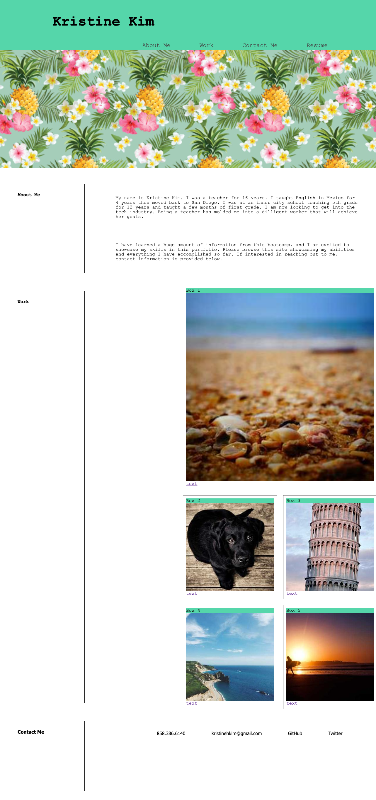

# kristinekim-portfolio
# Kristine Kim's Portfolio
> This is my portfolio showcasing my skills and talents throughout the bootcamp program.  Through this portfolio, you will be able to see the progress I have made while highlighting my strongest work.
> Live demo [_here_](https://kristinehkim.github.io/kristinekim-portfolio/). <!-- If you have the project hosted somewhere, include the link here. -->

## Table of Contents
* [General Info](#general-information)
* [Features](#features)
* [Screenshots](#screenshots)
* [Setup](#setup)
* [Usage](#usage)
* [Project Status](#project-status)
* [Room for Improvement](#room-for-improvement)
* [Acknowledgements](#acknowledgements)
* [Contact](#contact)
<!-- * [License](#license) -->

## General Information
I created this to have a portfolio showcasing all the projects I made encompassing everything that I have learned during this bootcamp.  My goal is to make it into the educational tech industry since I was a teacher and have a lot of background information and knowledge in that area.
<!-- You don't have to answer all the questions - just the ones relevant to your project. -->

## Features
- Navigation bar with links scrolling to the corresponding section and to my resume
- Images with links (that will present deployed applications)
- Contact me section in the footer if anyone needs to reach me

## Screenshots

<!-- If you have screenshots you'd like to share, include them here. -->

## Setup
Media query is used to respond to different sized screens and settings.  Background colors change and text will shift.  Flexbox and flexbox placement were used to set up and style the boxes.

## Usage
The links in the nav bar located on the top right of the webpage will jump down to that section of the page.  Each box has an image of a project linking to deployed sites. Alt attributes are included so people with disabilities have web accessibility.

## Project Status
Project is: _in progress_ 

## Room for Improvement

Room for improvement:
- Boxes to be styled more
- Overall styling to be improved

To do:
- Flexbox placement for the boxes
- Add deployed applications once created

## Acknowledgements
- Many thanks to my instuctor, Michael Pacheco, the TAs, Nirav Venkatesan and Julius Dorfman, and tutor, Dane Shrewsbury.  Also, I would like to acknowledge those that helped me in study groups, Vincent, Len, Benethea, Newmann, Oswaldo, Kevin, Michael, and probably a few more I may have missed.
- Resource: https://www.youtube.com/watch?v=FEmysQARWFU I used this video to help me create the footer.

## Contact
Created by Kristine Kim - feel free to email me at kristinehkim@gmail.com!

<!-- Optional -->
<!-- ## License -->
<!-- This project is open source and available under the [... License](). -->

<!-- You don't have to include all sections - just the one's relevant to your project -->